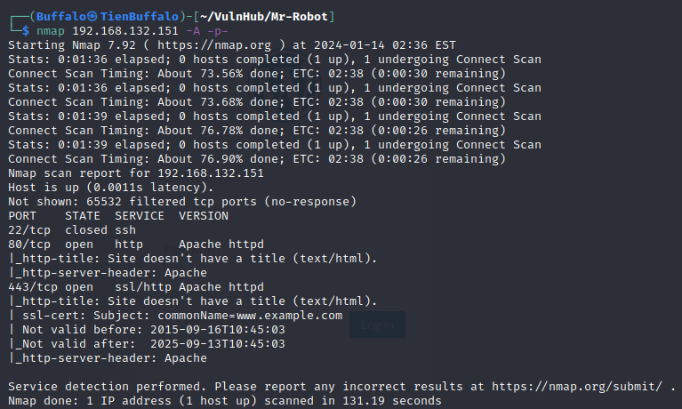
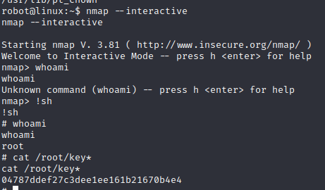

# Mr-Robot:1
***
## Mục tiêu : Tìm được 3 key
Tìm được địa chỉ máy của victim

Dò quét với nmap

Dịch vụ SSH cổng 22 đóng
Dịch vụ HTTP cổng 80 mở
Truy cập vào xem có gì

Sau khi thử một hồi không thấy gì đặc biệt, vì tên lab là mr-robot nên ta kiểm tra file robots.txt thì thấy 2 file fsocity.dic - tập hợp rất nhiều từ để dùng cho dictionary attack và key-1-of-3.txt gồm 1 key, nhìn tên file chắc là đây là key thứ 1.

>Key1: 073403c8a58a1f80d943455fb30724b9

Tải file fsocity.dic về máy : 
``` sh
curl -o fsocity.dic http://192.168.132.151/fsocity.dic
```

Có thể thấy file chứa 858160 từ, rất nhiều tuy nhiên cũng có rất nhiều từ bị lặp lại do vậy ta lưu 11451 từ unique vào để tý dùng: 
```sh
sort fsocity.dic | uniq > fsocity.dic.uniq
```

Sử dụng nikto để quét các lỗ hổng bảo mật phổ biến trên máy chủ web


Đến đây ta sử dụng hydra với wordlists là fsocity.dic.uniq
```
Post Web Form
Chúng ta cũng có thể sử dụng Hydra để bruteforce các web forms, bạn sẽ phải đảm bảo rằng bạn biết loại yêu cầu của nó – phương thức GET hoặc POST thường được sử dụng. Bạn có thể sử dụng tab Network trong trình duyệt (bấm F12 – developer tools) để xem các loại phương thức của request.

Dưới đây là ví dụ về lệnh Hydra để brute force một form login dùng phương thức POST.

hydra -l <username> -P <password list> <ip> http-post-form "/<login url>:username=^USER^&password=^PASS^:F=incorrect" -V

Giải thích các tùy chọn:

-l: Tên người dùng duy nhất
-P: cho biết sử dụng danh sách mật khẩu sau
http-post-form: cho biết loại phương thức (post)
/login url: URL trang đăng nhập
:username: trường biểu mẫu nơi tên người dùng được nhập
^USER^: yêu cầu Hydra sử dụng tên người dùng
password: trường biểu mẫu nơi mật khẩu được nhập
^PASS^: yêu cầu Hydra sử dụng danh sách mật khẩu đã cung cấp trước đó
Login: cho biết để rút lại thông báo đăng nhập không thành công
Login failed: là thông báo đăng nhập thất bại mà biểu mẫu trả về
F=incorrect: nếu từ này xuất hiện trên trang, thì nó không chính xác
-V: đầu ra cho mọi lần thử
```
Giờ ta tìm username trước , nếu sai thì sẽ hiện *Invalid username*


```sh
hydra -vV -L fsocity.dic.uniq -p 123456 192.168.132.151 http-post-form '/wp-login.php:log=^USER^&pwd=^PASS^&wp-submit=Log+In:F=Invalid username' -o username
```
Ta tìm thấy 3 username phù hợp


Làm tương tự với password

> Username: elliot
Password: ER28-0652

Ta đăng nhập thử

Qua tìm hiểu ta có thể upload reverse shell thông qua việc chỉnh sửa file

Tìm được key2 nhưng chỉ có robot mới có quyền đọc
Nâng cấp shell `python3 -c 'import pty;pty.spawn("/bin/bash")'`

Đọc file password .raw-md5 `robot:c3fcd3d76192e4007dfb496cca67e13b`
Crack md5 ta được `robot:abcdefghijklmnopqrstuvwxyz`

>Key2: 822c73956184f694993bede3eb39f959

Key thứ 3 ta cần phải leo quyền

```
Đây là câu lệnh quan trọng nhất của phần Privilege Escalation này, vậy nên cần hiểu kỹ.
Command: find / -perm -u=s -type f 2>/dev/null
Trong đó:
/: Tìm kiếm bắt đầu từ thư mục gốc (root) của hệ thống, việc này giúp quét toàn bộ files trong tất cả thư mục. Điều này giúp tăng phạm vi tìm kiếm.
-perm: Tìm kiếm theo các quyền được chỉ định sau đây.
-u=s: Tìm kiếm các file được sở hữu bởi người dùng root. Sử dụng -user [tên user] để tìm kiếm các files của user đó.
-type: chỉ định loại file tìm kiếm.
f: Chỉ định loại file cần tìm là các regular file, mà không là các thư mục hoặc các file đặc biệt. Hầu hết các file được sử dụng trực tiếp bởi người dùng là các regular file. Ví dụ: file thực thi, file văn bản, file hình ảnh... Điều này giúp tăng hiệu quả tìm kiếm.
2>: có nghĩa là redirect (kí hiệu là >) file channel số 2 tới nơi được chỉ định, file channel này ánh xạ tới stderr (standard error file channel), là nơi các chương trình thường ghi lỗi vào.
/dev/null: Đây là nơi được redirect đến, nó là một pseudo-device (thiết bị giả) hay một special character device mà nó cho phép write (ghi) bất cứ thứ gì lên nó, nhưng khi yêu cầu đọc nó, nó không return bất cứ thứ gì.
SUID ( hay Set user ID ) , thường được sử dụng trên các file thực thi ( executable files ). Quyền này cho phép file được thực thi với các đặc quyền (privileges) của chủ sở hữu file đó.
Ví dụ: nếu một file được sở hữu bởi user root và được set SUID bit, thì bất kể ai thực thi file, nó sẽ luôn chạy với các đặc quyền của user root. Và khi xem permissions của file, ở phần User, nhãn x sẽ được chuyển sang nhãn s.
```

Ở đây ta có thể lợi dụng nmap để leo thang

>Key3: 04787ddef27c3dee1ee161b21670b4e4
